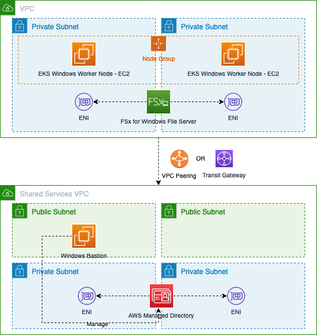
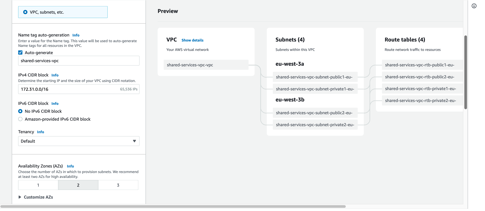
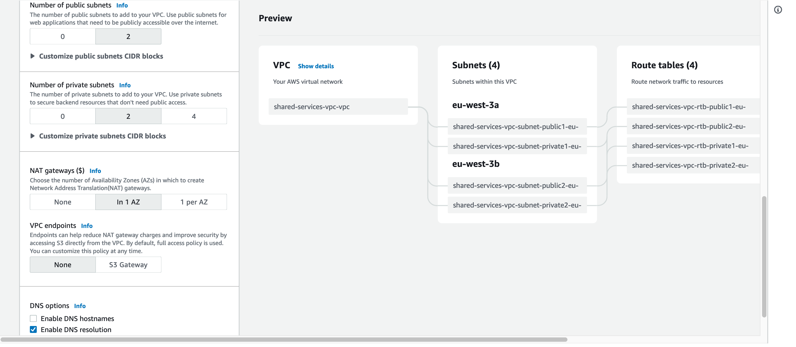
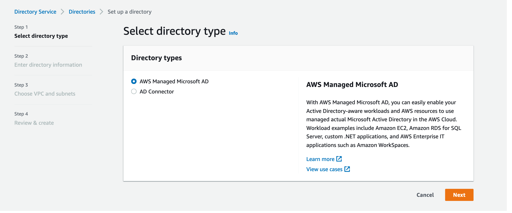
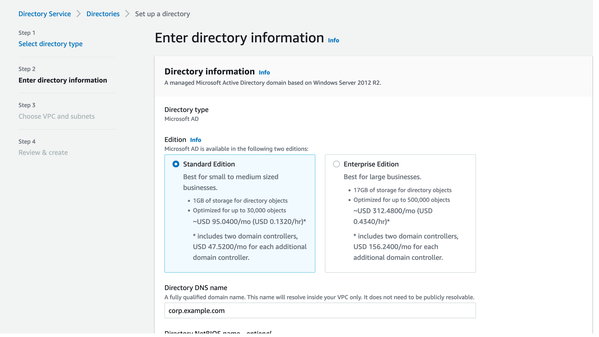
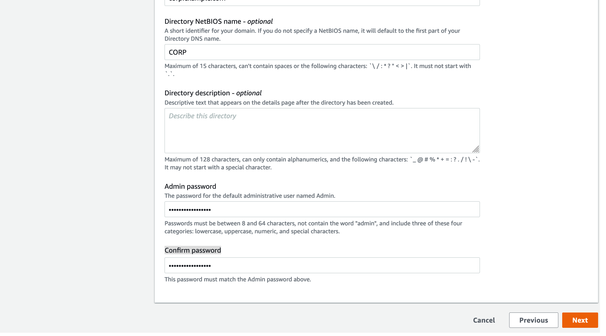
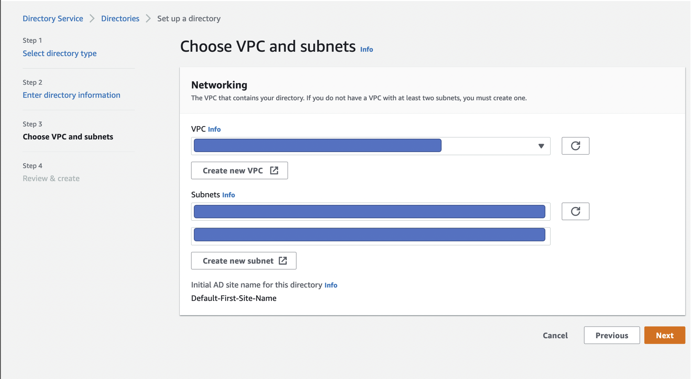
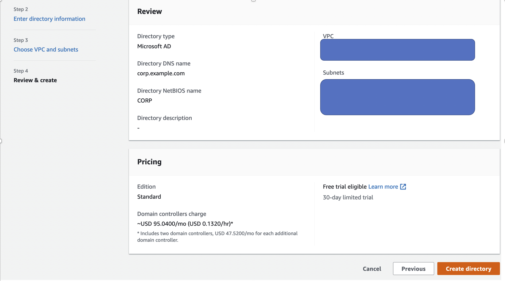
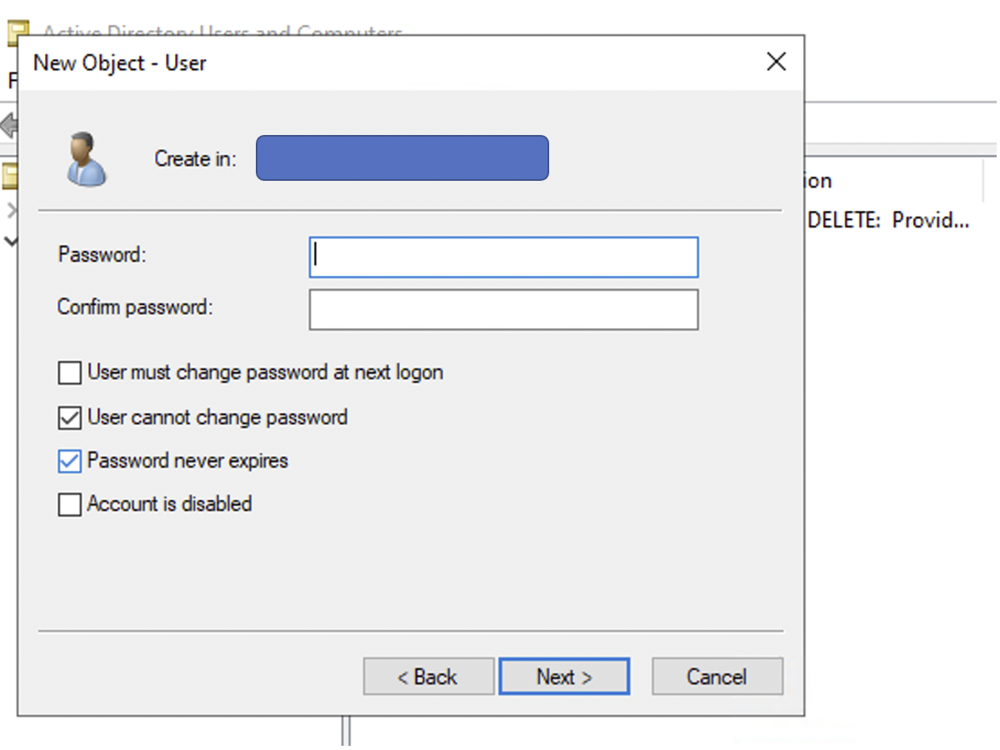

# Amazon EKS with Windows Worker Nodes and Amazon FSx for Windows File Server 

Amazon FSx for Windows File Server will need to be mounted as Windows via Microsoft SMB Protocol for usage. This requires Active Directory Domain Services to be available. 

**Deployment architecture**

**Following are the steps** 

1. Provision a shared services VPC. Ensure the VPC IP Active Directory Domain Services in a shared services VPC CIDR range does not conflict with the other VPC's where the shared services is to be made available. 

	

2. Provision a AWS Managed Microsoft AD within the private subnet of the above VPC. Use the following options during the creation of the VPC. 
	Edition: Standard Edition 
	Directory DNS name: < Domain name to use. Ex: corp.example.com>
	Directory NetBIOS name: CORP
	Admin password: < password >
	Confirm password: < password >
	VPC: < Select the shared services VPC >
	Subnets: < Select the private subnets >
	

3. Create a bastion/management Windows Server instance in the public subnet and login to the management instance and configure it to be connect to the AD Domain. Refer to https://docs.aws.amazon.com/directoryservice/latest/admin-guide/join_windows_instance.html 

4.  Once Windows EC2 instance joins the domain, login using AD admin credentials and create a service account for usage to connect to FSx Windows File Server. Ensure the following settings when creating the user account as this is a service account. 

Refer to https://docs.aws.amazon.com/directoryservice/latest/admin-guide/ms_ad_manage_users_groups_create_user.html 

5. Establish network connectivity between the shared services VPC and the VPC where EKS workloads and FSx Windows File Server are provisioned using either VPC Peering/AWS Transit Gateway.  For VPC peering, refer to https://networking.workshop.aws/intermediate/6-vpc-peering.html 

6. Provision FSx Windows File Server by specifying the AWS Managed Directory created in above step. Ensure the security group associated with the ENI's have the ingress rules allowing traffic from VPC or required subnets. 

7. Once the Windows worker nodes has been provisioned, join the EC2 servers by leveraging AWS Systems Manager capability as documented @ https://aws.amazon.com/premiumsupport/knowledge-center/ec2-systems-manager-dx-domain/. Build automation to automatically register the nodes to the AD domain. 

Following steps are documented @ https://aws.amazon.com/blogs/containers/using-amazon-fsx-for-windows-file-server-on-eks-windows-containers/ . Summarizing the key steps. 

8. Create Systems Manager Parameters to store the service account's username and password. 

Sample reference

CLI command for storing the service account username 

    aws ssm put-parameter --name "/<project>/fsx/domainUserName" --value "corp\<service-account-username>" --type String --tags "Key=Project,Value=<project>"

CLI command for creating the password 
 
     aws ssm put-parameter --name "/<project>/fsx/domainUserPassword" --value "<password>" --type "SecureString" --tags "Key=Project,Value=<project>"

9. Create an IAM policy with access to the Systems Manager Parameters created above to be retrieved and associate the policy to the IAM role associated with the EKS Windows worker nodes. Refer to execute-mount-iam-policy.json

10. Create a Systems Manager Document with the document as provided in load-fsx-as-mount-on-windows-node.json. Update the placeholders to refer to the above created system manager parameters and the FSx DNS Name and the mount directory. Execute the document against the EKS Windows worker node and verify the command execution was successful. 

11. Verify whether the Fsx for Windows File Server is mounted by connecting to the Windows server instance via Session manager and verify the file system is mounted. 

12. Deploy sample workload mentioned @  https://aws.amazon.com/blogs/containers/using-amazon-fsx-for-windows-file-server-on-eks-windows-containers/ 

